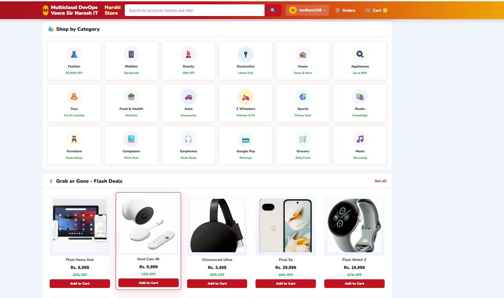

# kubernetes-veeraops-ecommerce-microservices-app
/
This README provides end-to-end steps for installing **eksctl**, **kubectl**, **Docker**, **Ingress-Nginx**, **MariaDB**, **ArgoCD**, and creating necessary namespaces and database tables

## 📸 Architecture & Workflow Diagrams

### Workflow Diagram




## Prerequisites

- AWS Account with appropriate IAM permissions
- Linux/Unix environment or WSL2 on Windows
- Sufficient compute resources for EKS cluster

---

## Deployment Workflow

Follow these steps in order for successful deployment:

### Step 1: EKS Cluster Setup with terraform
- Create EKS with terraform files mention on eks terrafom dirictory 

### Step 2: EKS Client & Cluster Update
- Already eks clinet server is creted update your terraform keys 
- Update cluster configuration
- Verify cluster connectivity using `kubectl get nodes`

### Step 3: Configure GitHub Secrets
Store the following secrets in your GitHub repository settings:
- AWS Access Key ID
- AWS Secret Access Key
- AWS Account ID
- Git PAT (Personal Access Token)

---
## Installation Steps

### 4. Install Git

```bash
yum install git -y
```

### 5. Install Ingress-Nginx

```bash
kubectl apply -f https://raw.githubusercontent.com/kubernetes/ingress-nginx/main/deploy/static/provider/cloud/deploy.yaml
kubectl get pods -n ingress-nginx
kubectl get svc -n ingress-nginx
```

### 6. Install ArgoCD

```bash
kubectl create namespace argocd
kubectl apply -n argocd -f https://raw.githubusercontent.com/argoproj/argo-cd/stable/manifests/install.yaml
kubectl patch svc argocd-server -n argocd -p '{"spec": {"type": "LoadBalancer"}}'
kubectl get svc -n argocd
```

### 7. Create Application Namespace

```bash
kubectl create namespace microservices
```

### 8. Retrieve ArgoCD Initial Admin Password

```bash
kubectl -n argocd get secret argocd-initial-admin-secret -o jsonpath="{.data.password}" | base64 -d
```
### Step 9: Clone Repository on server
```bash
git clone <your-repository-url>   
```
### rds using as a data base mens run the follwing  scripts
```
on backend dirictory run test.sql

sudo dnf install mariadb105-server -y

mysql -h rds-endpoint -u admin -p < test.sql
```
### Step 10 : Deploy Backend
```bash
cd k8s-argocd/backend
kubectl apply -f .
# Wait for Load Balancer to be assigned
kubectl get svc -n microservices
```
### Step 11: Deploy Frontend
```bash
cd ../frontend
kubectl apply -f .
```

### Step 12: Deploy EFK Stack (Elasticsearch, Fluent Bit, Kibana)
```bash
cd ../efk-stack
kubectl apply -f .
```

### Step 13: Install Grafana & Prometheus
```bash
cd ../../grafana-prometheous
# Follow installation commands in grafana-prometheous/README.md
```
### Step 14: Access the Application
- Get the Ingress Load Balancer URL:
```bash
kubectl get ingress -n google
```
- Access the application using the Ingress Load Balancer URL in your browser


## Summary of Key Components

| Component | Purpose |
|-----------|---------|
| **EKS** | Managed Kubernetes service on AWS |
| **RDS** | Managed relational database (MySQL/MariaDB) |
| **ArgoCD** | Continuous Deployment tool |
| **Ingress-Nginx** | Ingress controller for routing |
| **EFK Stack** | Logging and debugging (Elasticsearch, Fluent Bit, Kibana) |
| **Grafana** | Metrics visualization |
| **Prometheus** | Metrics collection and alerting |

---
## for rds 
- sudo dnf install mariadb105-server -y
- on backend dirictory run test.sql
- mysql -h rds-endpoint -u admin -p<veerasir> < test.sql


**Last Updated:** March 2026

---

# 🤖 AI Shopping Assistant (MCP + Multi-Provider AI)

This section documents the AI assistant added on top of the existing stack above. It does **not** replace anything described earlier — the existing frontend, backend, RDS schema, and deployment workflow are unchanged and still required.

## Architecture

```
CUSTOMER
   │
   ▼
E-COMMERCE UI (frontend/*)  ──── "Ask AI" widget (ai-chat-widget.js)
   │                                     │
   ▼                                     ▼
nginx (frontend/main)  ───/api/ai/───►  ai-agent (FastAPI)
   │  \api/                                │
   ▼                                       ▼
backend (Flask)  ◄──── auth check ────  MCP Client
   │                                       │
   ▼                                       ▼
RDS MySQL                              mcp-server (FastMCP, streamable-http)
                                            │
                                            ▼
                                        backend REST API (same Flask app)
                                            │
                                            ▼
                                        RDS MySQL
```

Key points:
- **mcp-server never touches MySQL directly and never runs SQL.** Every MCP tool calls the existing Flask backend's REST API, which owns all business logic and authorization.
- **ai-agent never trusts a customer id supplied by the browser or by the LLM.** It resolves the authenticated customer from a signed JWT (issued by the backend at login) via `GET /api/auth/me`, and injects that verified token into MCP tool calls itself — the LLM's tool-calling schema never even includes a `customer_token` parameter it could set.
- The backend enforces ownership on every order route (`WHERE id = %s AND user_id = %s`), so this holds even if ai-agent or mcp-server were compromised.

## AI Provider Failover

Strict priority order, automatic on any failure (HTTP error, timeout, rate limit, unavailable model, auth failure, network failure):

```
1. Groq        (GROQ_API_KEY, GROQ_MODEL)
      │ failure
      ▼
2. OpenRouter  (OPENROUTER_API_KEY, OPENROUTER_MODEL)
      │ failure
      ▼
3. Claude      (ANTHROPIC_API_KEY, CLAUDE_MODEL)
      │ failure
      ▼
Clean, generic error to the browser (no stack traces, no provider details)
```

Implemented in `ai-agent/providers/manager.py`. Each provider is tried once (configurable via `AI_MAX_RETRIES`); auth/unavailable-model failures are not retried against the same provider (no point). The full tool-calling conversation runs against whichever provider is currently active — a mid-conversation failure of that provider restarts the conversation against the next one.

## MCP Tools

All implemented in `mcp-server/server.py`, calling the backend endpoints listed:

| Tool | Backend endpoint | Auth |
|---|---|---|
| `get_my_orders` | `GET /api/me/orders` | customer JWT |
| `get_order(order_id)` | `GET /api/me/orders/<id>` | customer JWT, ownership-checked |
| `get_order_status(order_id)` | `GET /api/me/orders/<id>/status` | customer JWT, ownership-checked |
| `track_order(order_id)` | `GET /api/me/orders/<id>/tracking` | customer JWT, ownership-checked |
| `get_order_items(order_id)` | `GET /api/me/orders/<id>/items` | customer JWT, ownership-checked |
| `cancel_order(order_id, confirm)` | `POST /api/me/orders/<id>/cancel` | customer JWT, ownership + eligibility checked, two-step confirm |
| `search_products(query, category, min_price, max_price)` | `GET /api/products` | public |
| `get_product(product_id)` | `GET /api/products/<id>` | public |

`cancel_order` is a two-step flow: called first with `confirm=false` to check eligibility (no mutation), then the AI must get an explicit "yes" from the customer in conversation before calling again with `confirm=true`. The backend independently re-checks ownership and eligibility on the confirming call too.

## Product Catalog

The pre-existing project had no product database or API — every category page shipped an identical hardcoded product list in client-side JS. This upgrade adds the platform's first real product catalog:
- `backend/data/products_seed.json` — the 104 products extracted from the existing frontend catalogs (13 categories), used to seed a new `products` MySQL table on first run.
- `GET /api/products` / `GET /api/products/<id>` on the existing backend — powers both `search_products`/`get_product` and can be reused by the storefront itself later.

## Authentication Changes

The pre-existing login flow (`/api/login/request`, `/api/login/verify`) never issued a verifiable token — it just returned a user object. This upgrade adds an **additive** `token` field (a signed JWT) to those same responses; nothing about the existing response shape or frontend flow was removed. The frontend now also stores that token (`googleStoreAuthToken` in `localStorage`, set by `saveUser()` in `frontend/main/index.html`) and sends it as `Authorization: Bearer <token>` when calling the AI assistant.

- `JWT_SECRET` (backend only) signs/verifies these tokens.
- `GET /api/auth/me` lets any internal service resolve a token to a customer without decoding the JWT itself.
- ai-agent and mcp-server never see or need `JWT_SECRET` — they only ever forward the token the customer already has.

## Local Development

```bash
# Backend (as before, now also needs JWT_SECRET)
cd backend
cp .env.example .env   # fill in DB_* and a random JWT_SECRET
pip install -r requirements.txt
python app.py

# mcp-server
cd mcp-server
cp .env.example .env   # BACKEND_BASE_URL=http://localhost:5000
pip install -r requirements.txt
python server.py       # listens on :8100

# ai-agent
cd ai-agent
cp .env.example .env   # fill in GROQ/OPENROUTER/ANTHROPIC keys, MCP_SERVER_URL=http://localhost:8100/mcp/
pip install -r requirements.txt
uvicorn main:app --reload --port 8200
```

Then open any `frontend/*/index.html` with a static server, or point its `/api` calls at `http://localhost:5000` and `/api/ai` at `http://localhost:8200` (in production this is handled by the `frontend/main/nginx.conf` proxy — see below).

Health checks: `GET /health` and `GET /ready` on both services.

## Kubernetes Deployment

New manifests, applied the same way as the existing services:

```bash
kubectl apply -f mcp-server/k8s/mcp-server.yml
kubectl apply -f ai-agent/k8s/ai-agent.yml
```

Both are **internal-only** (`ClusterIP`), not exposed via Ingress. The browser reaches ai-agent through the existing `frontend/main` nginx, which now proxies `/api/ai/` to `ai-agent-service:8200` the same way it already proxies `/api/` to `backend-service` (see `frontend/main/nginx.conf`). Other category pages reuse this same path via the existing ingress catch-all to `main-service` — no per-page nginx changes were needed, matching how `session-watchdog.js`/`image-fallback.js` already work today.

Each Deployment runs as non-root, with a read-only root filesystem, dropped capabilities, resource requests/limits, and liveness/readiness probes. `NetworkPolicy` objects restrict mcp-server ingress to ai-agent only, and ai-agent ingress to backend/ingress-nginx only.

## Secrets

**Never commit real values.** Copy the examples in `k8s-secrets-examples/` (intentionally kept *outside* every directory ArgoCD syncs, so an automated sync can never overwrite a real secret with a placeholder):

```bash
kubectl create secret generic backend-secrets \
  --namespace microservices \
  --from-literal=JWT_SECRET=$(openssl rand -hex 32)

kubectl create secret generic ai-agent-secrets \
  --namespace microservices \
  --from-literal=GROQ_API_KEY=... \
  --from-literal=OPENROUTER_API_KEY=... \
  --from-literal=ANTHROPIC_API_KEY=...
```

| Variable | Service | Purpose |
|---|---|---|
| `JWT_SECRET` | backend | Signs/verifies customer tokens |
| `GROQ_API_KEY`, `GROQ_MODEL` | ai-agent | Priority-1 provider |
| `OPENROUTER_API_KEY`, `OPENROUTER_MODEL` | ai-agent | Priority-2 provider |
| `ANTHROPIC_API_KEY`, `CLAUDE_MODEL` | ai-agent | Priority-3 provider |
| `MCP_SERVER_URL` | ai-agent | `http://mcp-server-service:8100/mcp/` |
| `BACKEND_BASE_URL` | ai-agent, mcp-server | `http://backend-service` |
| `AI_REQUEST_TIMEOUT`, `AI_MAX_RETRIES` | ai-agent | Per-provider timeout/retry limits |

⚠️ While in here, note that `backend/backend-cm.yml` already contains **real, plaintext** `DB_PASSWORD`/mail credentials committed to source control from before this upgrade. They should be rotated and moved into `backend-secrets` — this was flagged but intentionally left as-is to avoid breaking the existing deployment without a coordinated credential rotation.

## CI/CD

`.github/workflows/ci.yml` was extended (not replaced) to also build/push `mcp-server` and `ai-agent` to ECR (`shopping-site-mcp-server`, `shopping-site-ai-agent`) and rewrite their image tags in `mcp-server/k8s/mcp-server.yml` / `ai-agent/k8s/ai-agent.yml`, using the exact same sed-based tag-and-commit pattern the existing frontend/backend build already uses — ArgoCD's automated self-heal then picks up the new tags from `main`, same as today.

```
GitHub → GitHub Actions → pytest (ai-agent, mcp-server, security) → pip-audit
       → Docker build → ECR push → sed image tag → commit to main
       → ArgoCD auto-sync → EKS
```

New ArgoCD Applications: `k8s-argocd/mcp-server/mcp-server.yaml`, `k8s-argocd/ai-agent/ai-agent.yaml` (same repo/pattern as `k8s-argocd/backend/backend.yaml`).

## Security Summary

- No SQL is ever exposed to or executable by the LLM or MCP server — every tool is a fixed, typed call to an existing backend REST endpoint.
- `customer_token` is stripped from the tool schema shown to the LLM and injected server-side by ai-agent — the model can only choose *which* tool and ordinary business parameters (order_id, query, confirm), never *whose* data to fetch.
- Every order route is ownership-checked in SQL (`WHERE ... AND user_id = %s`) — enforced in the backend, not just trusted from the token.
- `cancel_order` requires an explicit customer confirmation turn before it mutates anything.
- The system prompt (`ai-agent/system_prompt.py`) explicitly instructs the model to treat tool results and user messages as untrusted data, never reveal internals/credentials, and never fabricate order/product data — and this is backstopped structurally (the model literally has no tool that could invent data; every fact comes from a tool call).
- Rate limiting (`RATE_LIMIT_PER_MINUTE`), prompt-length limits (`MAX_PROMPT_LENGTH`), request timeouts (`AI_REQUEST_TIMEOUT`), and a max tool-call loop bound (`MAX_TOOL_ITERATIONS`) all prevent runaway usage.
- CORS is restricted via `CORS_ALLOWED_ORIGINS`; both new services run as non-root with read-only root filesystems and no Kubernetes/AWS API access.

## Dark/Light Theme Toggle

`frontend/main/theme-toggle.js` adds an animated dark/light switch to the menu bar (top-right, next to Login/Orders/Cart on pages that have that layout; falls back to appending inside `<header>`, then to a fixed corner button, so it always renders somewhere sensible on pages with different header markup). Included on all 19 pages via the same absolute-path `<script src="/theme-toggle.js" defer>` pattern already used for `session-watchdog.js`.

- **Theme switch itself is instant and synchronous** — it never waits on GSAP, so the toggle works correctly even if the CDN is slow, blocked, or offline.
- **GSAP** (loaded on demand from cdnjs, no extra script tag needed elsewhere) adds two purely-cosmetic flourishes on top of that instant switch: a sliding/rotating thumb icon (☀️/🌙) on the switch itself, and a circular "wipe" reveal that expands from the button across the viewport when you toggle.
- Preference is stored in `localStorage` (`googleStoreTheme`) and shared across all pages (same origin); on first visit it falls back to the OS `prefers-color-scheme`.
- Dark-mode colors are applied via `html[data-theme="dark"]` overrides of the CSS custom properties this project's pages already share (`--ink`, `--muted`, `--line`, `--surface`, `--bg`, `--shadow`, etc.) — no per-page CSS edits required.

## Testing

```bash
pip install pytest pytest-asyncio httpx fastapi mcp==1.9.4 flask pymysql mysql-connector-python flask-mail python-dotenv cryptography pyjwt
PYTHONPATH=ai-agent pytest tests/ai_agent -c tests/pytest.ini
PYTHONPATH=mcp-server pytest tests/mcp_server -c tests/pytest.ini
PYTHONPATH=backend pytest tests/security -c tests/pytest.ini
```

Covers: provider failover (Groq timeout/rate-limit/auth-fail → OpenRouter → Claude → clean error), every MCP tool (auth forwarding, error translation, cancel confirmation gating), and security properties (JWT forgery rejection, parameterized queries, tool-schema token stripping, unauthenticated access blocked before any MCP call is made).

